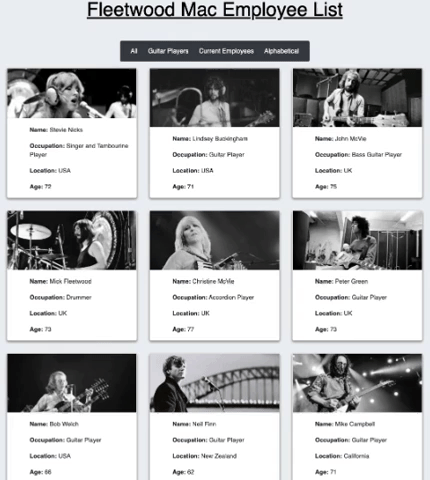

# Fleetwood Mac Employee List
  

<a href="https://tomarapetty.github.io/Employee-Directory/">Click here to see it in action.</a>

## Table of Contents
* [Description](#description)
* [Installation](#installation)
* [Usage](#usage)
* [License](#license)
* [Contributions](#contributions)
* [Tests](#tests)
* [Questions](#questions)

## Description 
*Overview of this project:* 
* This page features a list of employees of the band Fleetwood Mac. 
* Each employee's information comes up in a card with a photo, where they are from, age, etc. 
* Employees can be filtered by current employees, all or guitar players. 
* Employees can be sorted in alphabetical order.

## Installation
*Steps required to install project and get the development environment established:*
* This project was built with Create React App. 
* In the project directory, you can run: `npm start` to start the app on your local host. 

## Usage
*Instructions and examples for use:* 
* This project was built with Create React App. 
* In the project directory, you can run: `npm start` to start the app on your local host. 

## License 
* Built under the MIT licence.

## Credits
* Built & designed by Tomara Petty

## Questions?

 
If you have any questions or want to make a contribution please reach out to me here: 

* GitHub: @tomarapetty 
* Email: tomara.petty@gmail.com
* LinkedIn: https://www.linkedin.com/in/tomara-petty/
